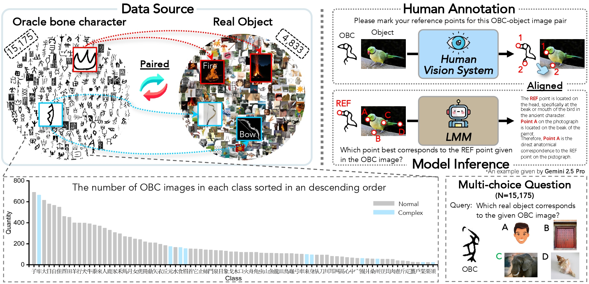
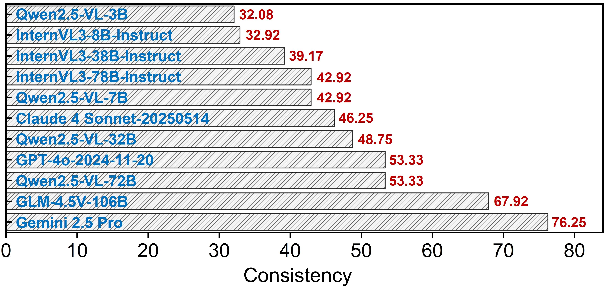
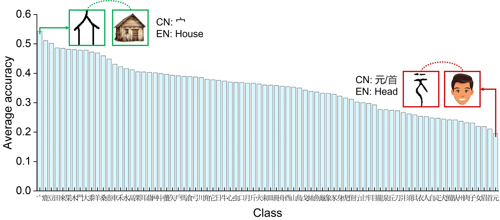
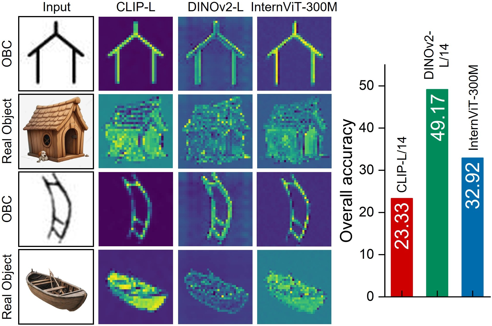

    
    
    

<h1>PictOBI-20k: Unveiling Large Multimodal Models in Visual Decipherment for Pictographic Oracle Bone Characters 🔍</h1>

_A pioneering benchmark bridging large multimodal models with the visual decipherment of ancient Chinese oracle bone scripts_

    Zijian Chen1,2,†,
    Wenjie Hua3,†,
    Jinhao Li4,
    Lirong Deng5,
    Fan Du6,
    Tingzhu Chen1,★,
    Guangtao Zhai1,2,★

  1Shanghai Jiao Tong University  
  2Shanghai AI Lab  
  3Wuhan University  
  4East China Normal University  
  5Macao Polytechnic University  
  6Southern University of Science and Technology  

  †Equal contribution &nbsp;&nbsp; ★Corresponding authors

      
  

  
> Overview of **PictOBI-20k**:  
> We present **PictOBI-20k**, a large-scale dataset for evaluating LMMs on the visual decipherment of pictographic Oracle Bone Characters (OBCs). The dataset comprises **20k carefully curated OBC–object image pairs** and over **15k multi-choice questions**. To further assess visual reasoning, we provide **subjective annotations** examining the consistency of reference points between humans and LMMs. Experimental results suggest that while general LMMs exhibit preliminary visual decipherment ability, they often fail to effectively leverage visual information and remain constrained by language priors. We hope PictOBI-20k can serve as a foundation for advancing evaluation and optimization of **visual attention in OBC-oriented LMMs**.

## Release
- [TBA] Public datasets release.  
- [2025/09/09] 🔥 Github repository for **PictOBI-20k** is online.

## General Principles
##### Focusing on OBC Visual-Decipherment Abilities of LMMs & Variant-Aware Evaluation

      
  

## Image / Doc Sources
Dataset figures and outlines are curated from our study materials; we additionally provide short docs for quick orientation.

      
  

- Docs: [Intro (PDF)](assets/intro.pdf) · [Overview (PDF)](assets/overview.pdf) · [Reference Map (PDF)](assets/reference_map.pdf)

## Benchmark Candidates
We evaluate representative multimodal models (details in the paper) under unified protocols for classification, retrieval, and variant-group consistency.

      
  

## Performance Benchmark on Pictographic OBC Tasks 

Results on the classification tasks (click to expand)

      
  

Results on the retrieval tasks (click to expand)

      
  

Results on the consistency (variant-stability) tasks (click to expand)

      
  

## Dataset Splits 📦
- [x] To be released with `dataset/` metadata and variant maps.

## Contact 📧
Please contact the authors for queries.

- Wenjie Hua, `huawenchieh@gmail.com`

## Citation📎
If you find our work interesting, please cite:

