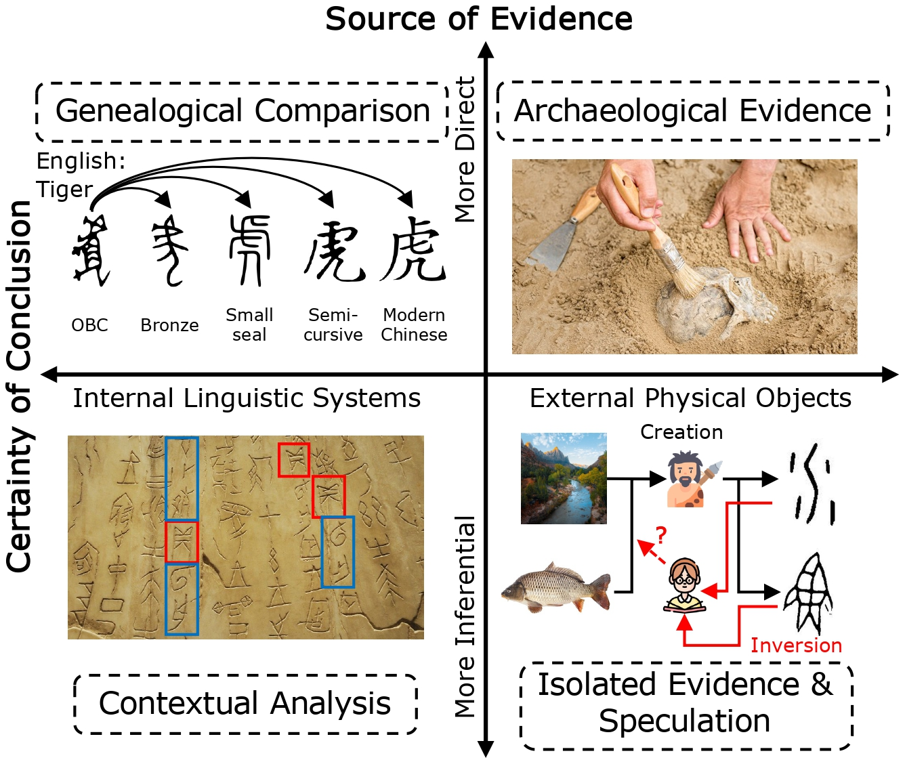
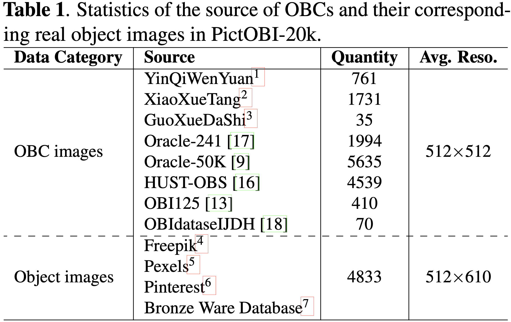
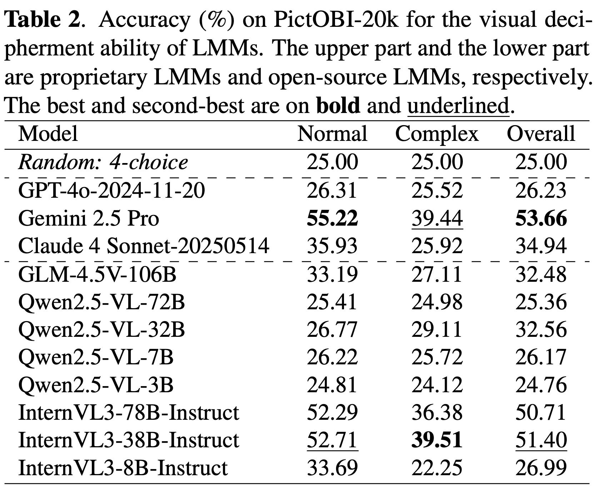

    
    
    

<h1>PictOBI-20k: Unveiling Large Multimodal Models in Visual Decipherment for Pictographic Oracle Bone Characters 🔍</h1>

_A pioneering benchmark bridging large multimodal models with the visual decipherment of ancient Chinese oracle bone scripts_

    <a href="https://scholar.google.com.hk/citations?hl=zh-CN&user=NSR4UkMAAAAJ" target="_blank">Zijian Chen</a>1,2,†,  
    Wenjie Hua3,†,  
    Jinhao Li4,  
    Lirong Deng5,  
    Fan Du6,  
    <a href="https://shss.sjtu.edu.cn/Web/FacultyDetail/46?f=1&t=4" target="_blank">Tingzhu Chen</a>1,★,  
    <a href="https://scholar.google.com.hk/citations?hl=zh-CN&user=E6zbSYgAAAAJ" target="_blank">Guangtao Zhai</a>1,2,★

  1Shanghai Jiao Tong University  
  2Shanghai AI Lab  
  3Wuhan University  
  4East China Normal University  
  5Macao Polytechnic University  
  6Southern University of Science and Technology  

  †Equal contribution &nbsp;&nbsp; ★Corresponding authors

  

  
> Overview of **PictOBI-20k**: We present **PictOBI-20k**, a large-scale dataset for evaluating LMMs on the visual decipherment of pictographic Oracle Bone Characters (OBCs). The dataset comprises **20k carefully curated OBC–object image pairs** and over **15k multi-choice questions**. To further assess visual reasoning, we provide **subjective annotations** examining the consistency of reference points between humans and LMMs. Experimental results suggest that while general LMMs exhibit preliminary visual decipherment ability, they often fail to effectively leverage visual information and remain constrained by language priors. We hope PictOBI-20k can serve as a foundation for advancing evaluation and optimization of **visual attention in OBC-oriented LMMs**.

## Release
- [TBA] Public datasets release.  
- [2025/09/09] 🔥 Github repository for **PictOBI-20k** is online.

## Overview of PictOBI-20k
##### Focusing on the Visual-Decipherment Abilities of LMMs for OBCs

We collect OBC and real object images from 12 sources, covering multiple font appearances and categories. Based on these, we construct 15,175 multi-choice questions for LMM evaluation. Meanwhile, we conduct human annotations for obtaining reference points on OBC-object image pairs.

      

## OBC and Real-Object Image Sources

We collect OBC images from **three OBC-centric** ancient script websites, YinQiWenYuan, XiaoXueTang, and GuoXueDaShi, as well as **five open-source OBC datasets**, including **Oracle-241, Oracle-50k, HUST-OBS, OBI125, and OBIdatasetIJDH**. Corresponding **real-object images** (≈4.8k) are carefully collected from Freepik, Pexels, Pinterest, and the Academia Sinica Bronze Ware Database.

  

## Benchmark Candidates

We evaluate **11** LMMs—including GPT-4o, Gemini 2.5 Pro, Claude 4 Sonnet, GLM-4.5V, the Qwen2.5-VL family, and the InternVL3 series—alongside three vision encoders (DINOv2-L/14, CLIP-L/14, InternViT-300M) to assess multimodal and visual-only performance on pictographic OBCs.

  

## Performance Benchmark on Pictographic OBC Tasks 

Results on the classification tasks (click to expand)

      
  

Results on the retrieval tasks (click to expand)

      
  

Results on the consistency (variant-stability) tasks (click to expand)

      
  

## Dataset 📦
- [x] To be released with `dataset/` OBC and real-object image

## Contact 📧
Please contact the authors for queries.

- Zijian Chen, `zijian.chen@sjtu.edu.cn`

## Citation📎
If you find our work interesting, please cite:

